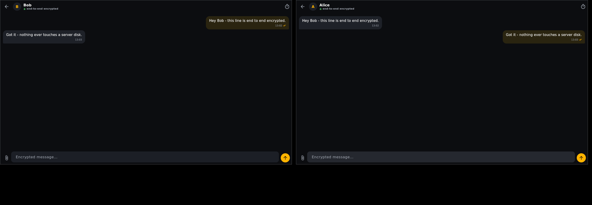

# Z — zero‑trust messenger

**No accounts. No phone numbers. No server storage.** Z is an end‑to‑end
encrypted 1:1 messenger where messages live **only** on the two devices that
exchanged them. The server is a dumb relay that shuttles opaque ciphertext and
keeps undelivered messages in RAM only — never on disk.

> Zero trust means you don't have to trust the server to keep your messages
> private. The relay cannot read, alter, or forge anything. Please read
> [`docs/THREAT_MODEL.md`](docs/THREAT_MODEL.md) for exactly what that does and
> does not cover (metadata, endpoints, first‑contact verification).



## Get running in ~5 minutes

The only thing you host is the **relay** (a dumb pipe that stores nothing
readable). Put it on a free cloud tier and you're done — full walkthrough in
**[`DEPLOY.md`](DEPLOY.md)**.

[](https://render.com/deploy)

1. Push this repo to GitHub (`bash deploy/push-to-github.sh`, or by hand).
2. Click the button above (or Render → New → Blueprint) → you get a free
   `wss://z-relay-xxxx.onrender.com` address.
3. Install the app, paste that address, tap **Test connection**, and message.

No domain needed — Render/Fly hand you an HTTPS/wss URL automatically. Prefer
your own server or Fly.io? See [`docs/SELF_HOSTING.md`](docs/SELF_HOSTING.md).

## Highlights

- **End‑to‑end encryption** with the Signal‑style **Double Ratchet**
  (X25519 + HKDF + HMAC), messages sealed with **XChaCha20‑Poly1305**. Forward
  secrecy and post‑compromise healing on every round trip.
- **No message storage on any server.** The reference relay is RAM‑only and
  runs happily with a read‑only filesystem. Restart = clean slate.
- **No identifiers.** Your address is a hash of your public key. Add contacts
  by scanning a QR code or pasting a signed contact code.
- **Encrypted local vault.** On‑device SQLite, every sensitive cell encrypted
  under a key held in the OS keystore — with an **optional passphrase** (Argon2id)
  that unlocks the app on this device. The passphrase composes with the keystore
  and never leaves the device.
- **Disappearing messages** (per‑chat timer) and **encrypted attachments**
  (per‑file key delivered inside the ratchet, chunks sealed and hash‑verified).
- **Safety numbers** to detect machine‑in‑the‑middle key substitution.
- **Scales out** — run one relay, or many behind a load balancer sharing a
  RAM‑only Redis (still zero‑knowledge). See `docs/SELF_HOSTING.md`.
- **One codebase, four targets:** Android, Windows, Linux, macOS (Flutter).

## Project docs

- **[`docs/REVIEW.md`](docs/REVIEW.md)** — full application review: architecture,
  what's verified, the bugs found & fixed, and an honest production-readiness
  assessment.
- **[`ROADMAP.md`](ROADMAP.md)** — the path to a public launch, week-sized phases
  with a definition-of-done for each ([visual timeline](docs/roadmap.html)).
- **[`DEPLOY.md`](DEPLOY.md)** — get the relay online in ~5 minutes (one-click).
- **[`docs/WINDOWS.md`](docs/WINDOWS.md)** — running Z on Windows.
- **[`docs/THREAT_MODEL.md`](docs/THREAT_MODEL.md)** · **[`docs/PROTOCOL.md`](docs/PROTOCOL.md)** · **[`docs/SELF_HOSTING.md`](docs/SELF_HOSTING.md)** · **[`docs/BUILD.md`](docs/BUILD.md)**

## Repository layout

```
z-messenger/
├── protocol/   Pure‑Dart E2E crypto core (identities, X3DH, Double Ratchet,
│               attachments, relay client) + full test suite incl. a real
│               end‑to‑end integration test through the Node relay.
├── server/     Zero‑knowledge, RAM‑only WebSocket relay (Node.js) + tests +
│               Dockerfile (read‑only fs) + docker‑compose.
├── app/        Flutter application (Android / Windows / Linux / macOS).
├── docs/       Threat model, protocol spec, self‑hosting guide, screenshots.
└── .github/    CI that tests everything and builds installers for all four
                platforms.
```

## Quick start

### 1. Run a relay

```bash
cd server
npm install
npm start                 # listens on :8080 (ws://)
# or, provably storage-less, behind a read-only container:
docker compose up --build
```

For real use put it behind TLS (`wss://`) — see
[`docs/SELF_HOSTING.md`](docs/SELF_HOSTING.md). A relay is cheap: it holds only
transient ciphertext in memory.

### 2. Build & run the app

```bash
cd app
flutter pub get
flutter run -d linux      # or: windows, macos, or an attached Android device
```

On first launch, pick a display name and point the app at your relay
(`ws://localhost:8080` for local testing, `wss://your-relay` in production).
Share your contact code (Add contact → My code) with someone running Z, add
theirs, and start messaging. Compare safety numbers to verify no one is in the
middle.

### 3. Prebuilt installers

Every push builds artifacts for all four platforms in CI
([`.github/workflows/build.yml`](.github/workflows/build.yml)); tagging a
`vX.Y.Z` release attaches them:

- **Android:** `app-release.apk` (and per‑ABI splits)
- **Linux:** `z-linux-x64.tar.gz` (unpack and run `zapp`)
- **Windows:** `z-windows-x64.zip` (unzip and run `zapp.exe`)
- **macOS:** `z-macos.zip` (unzip `Z.app`)

## How it works (short version)

1. Your device generates an Ed25519 + X25519 identity. Nothing is registered
   anywhere.
2. You and a contact swap **signed public‑key bundles** out‑of‑band (QR/text).
3. An **X3DH‑style handshake** derives a shared secret; the **Double Ratchet**
   takes over, giving every message its own key.
4. Ciphertext goes to the relay addressed to a **routing id** (a hash). The
   relay holds it in RAM until the recipient's device fetches it, confirms it
   persisted locally, and the relay drops it.
5. Both devices store messages in an **encrypted local vault**. No server ever
   sees plaintext, names, or files.

Full details in [`docs/PROTOCOL.md`](docs/PROTOCOL.md).

## Testing

```bash
# Relay unit tests (auth, RAM queueing, no-disk-writes assertion, spoofing)
cd server && npm test

# Protocol tests + a REAL end-to-end conversation through the Node relay
cd protocol && dart test
```

The integration test (`protocol/test/relay_integration_test.dart`) spins up the
actual relay, connects two real protocol clients, and exercises the handshake,
out‑of‑order delivery, offline RAM‑queueing, delivered receipts, and an
encrypted attachment — then asserts the relay never saw any plaintext.

## Status & honesty

Z is a complete, working implementation built from well‑studied primitives. It
has **not** had an independent security audit. It is not affiliated with Signal.
Do not use it for life‑or‑death threat models without a professional review.
See the threat model for the residual risks (metadata, endpoint security,
first‑contact verification).

## License

MIT. See `LICENSE`.
